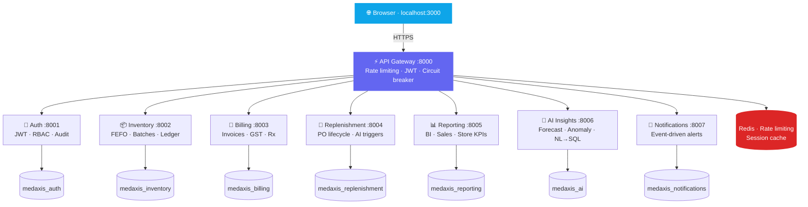

<div align="center">


<br/>

[](https://git.io/typing-svg)

<br/>

[](https://github.com/KUMARankit23/MedAxis_Ai/actions/workflows/ci.yml)
[](LICENSE)
[](https://python.org)
[](https://fastapi.tiangolo.com)
[](https://react.dev)
[](https://docs.docker.com/compose)
[](https://postgresql.org)

</div>

---

## What is MedAxis?

**MedAxis** is a production-grade **pharmacy operations platform** built with a microservices architecture. It manages inventory, billing, replenishment, and analytics across multiple pharmacy outlets — with AI agents that forecast demand, detect sales anomalies, and answer plain-English questions about your data.

> Built for pharmacy chains that need real-time stock visibility, FEFO-compliant dispensing, and AI-powered replenishment — all in one platform.

---

## Live Preview

<div align="center">

| Login Page | Dashboard | AI Insights |
|:---:|:---:|:---:|
| Split-screen brand panel | KPI cards + live charts | NL → SQL query agent |
| Role-based redirect | Skeleton loading states | Demand forecasting chart |

</div>

---

## Architecture



---

## Features

<table>
<tr>
<td width="50%">

### Backend
- **8 independent microservices** — each with its own PostgreSQL DB, Alembic migrations, and Swagger UI
- **JWT authentication** with role-based access control
- **FEFO stock deduction** — batches expire in the correct order automatically
- **Redis rate limiting** with sliding window algorithm
- **Circuit breaker** at the gateway to prevent cascade failures
- **Correlation IDs** propagated across all services for tracing
- **Prometheus metrics** on every service
- **Structured JSON logging** compatible with any log aggregator

</td>
<td width="50%">

### AI / ML
- **Demand Forecasting** — scikit-learn LinearRegression predicts 7-day demand per medicine per outlet
- **Anomaly Detection** — IsolationForest flags unusual sales spikes or drops and notifies admin
- **Natural Language → SQL** — OpenAI GPT-4o-mini (with pattern-matching fallback) converts plain English questions into SQL queries and runs them live
- **Auto-replenishment triggers** — AI agent creates purchase orders when stock runs low

### Frontend
- **Premium React UI** — Inter font, dark sidebar, split-screen login
- **Real-time charts** — Recharts line, bar, and donut charts
- **Skeleton loaders** — graceful loading states on every page
- **Auto token refresh** — transparent JWT renewal on 401

</td>
</tr>
</table>

---

## Tech Stack

<div align="center">

[](https://skillicons.dev)

</div>

<br/>

| Layer | Technology |
|---|---|
| **Backend** | Python 3.12, FastAPI 0.111, SQLAlchemy 2.0 (async), Pydantic v2 |
| **Database** | PostgreSQL 15 — one database per service, Alembic migrations |
| **Cache / Queue** | Redis 7 |
| **Auth** | PyJWT, bcrypt, RBAC with 4 roles |
| **AI / ML** | scikit-learn (LinearRegression, IsolationForest), OpenAI GPT-4o-mini |
| **Frontend** | React 18, React Router v6, Recharts, Axios, Lucide icons |
| **Proxy** | Nginx (TLS termination, API proxy, gzip, cache headers) |
| **Observability** | Prometheus metrics, Sentry error tracking, structured JSON logs |
| **CI/CD** | GitHub Actions — lint → test → Docker build → push to GHCR |

---

## Services

| Service | Port | Swagger | Responsibility |
|---|---|---|---|
| **API Gateway** | 8000 | — | Single entry point, rate limiting, routing, circuit breaker |
| **Auth** | 8001 | [/docs](http://localhost:8001/docs) | JWT auth, RBAC, user management, audit trail |
| **Inventory** | 8002 | [/docs](http://localhost:8002/docs) | Medicines, batches, FEFO stock, ledger, expiry alerts |
| **Billing** | 8003 | [/docs](http://localhost:8003/docs) | Prescriptions, OTC/Rx invoicing, GST calculation |
| **Replenishment** | 8004 | [/docs](http://localhost:8004/docs) | Purchase orders, AI-triggered reorders, approval flow |
| **Reporting** | 8005 | [/docs](http://localhost:8005/docs) | BI dashboards, sales analytics, store performance |
| **AI Insights** | 8006 | [/docs](http://localhost:8006/docs) | Demand forecasting, anomaly detection, NL→SQL queries |
| **Notifications** | 8007 | [/docs](http://localhost:8007/docs) | Event-driven alerts for low stock and anomalies |

---

## Quick Start

### Prerequisites

- [Docker Desktop](https://docs.docker.com/get-docker/) (includes Docker Compose)
- Git

### 1 — Clone and configure

```bash
git clone https://github.com/KUMARankit23/MedAxis_Ai.git
cd MedAxis_Ai
cp .env.example .env
```

Edit `.env` — minimum required:
```env
DB_PASSWORD=your-strong-password
JWT_SECRET=your-64-char-random-hex   # generate: python -c "import secrets; print(secrets.token_hex(32))"
```

### 2 — Start all services

```bash
docker compose up -d --build
```

First startup takes ~2–3 minutes while images build. Watch progress:
```bash
docker compose logs -f
```

Wait until all services show **healthy**:
```bash
docker ps
```

### 3 — Seed demo data

```bash
python init-db/02_seed_data.py
```

### 4 — Open the app

| URL | What |
|---|---|
| **[http://localhost:3000](http://localhost:3000)** | React frontend (main app) |
| http://localhost:8000/health | Gateway health check |
| http://localhost:8001/docs | Auth API docs |
| http://localhost:8002/docs | Inventory API docs |
| http://localhost:8003/docs | Billing API docs |

### Demo credentials

| Username | Password | Role | Access |
|---|---|---|---|
| `admin` | `Admin@123` | Admin | Full access to everything |
| `supervisor1` | `Super@123` | Supervisor | Analytics, approvals, AI insights |
| `pharmacist1` | `Pharma@123` | Pharmacist | Billing and inventory |
| `planner1` | `Plan@123` | Inventory Planner | Stock and replenishment |

---

## Common Commands

```bash
make up           # Start all services
make down         # Stop all services
make logs         # Tail all service logs
make seed         # Seed demo data
make test         # Run test suite
make lint         # Run ruff linter
make health       # Check gateway health
make cache-clear  # Flush Redis cache
make prod-up      # Start production stack (with Nginx TLS)
make help         # List all commands
```

---

## API Reference

<details>
<summary><b>Auth Service — /auth/*</b></summary>

```
POST /auth/login                    → { access_token, refresh_token, user }
POST /auth/refresh                  → { access_token, refresh_token }
POST /auth/logout                   → { message }
GET  /auth/me                       → UserResponse
GET  /auth/users                    → [UserResponse]          [admin]
POST /auth/users                    → UserResponse            [admin]
POST /auth/users/{id}/deactivate    → { message }             [admin]
POST /auth/users/{id}/unlock        → { message }             [admin]
GET  /auth/audit-logs               → [AuditLogResponse]      [admin/supervisor]
```
</details>

<details>
<summary><b>Inventory Service — /inventory/*</b></summary>

```
GET  /inventory/medicines                → [MedicineResponse]
POST /inventory/medicines                → MedicineResponse
POST /inventory/batches                  → BatchResponse
GET  /inventory/stock/{outlet_id}        → [StockLevelResponse]
GET  /inventory/alerts/low-stock         → [LowStockItem]
GET  /inventory/alerts/expiring          → [ExpiringBatchItem]
GET  /inventory/ledger/{medicine_id}     → [LedgerEntry]
POST /inventory/transfer                 → { message }
POST /inventory/batches/{id}/quarantine  → { message }
```
</details>

<details>
<summary><b>Billing Service — /billing/*</b></summary>

```
GET  /billing/invoices              → [InvoiceResponse]
POST /billing/invoices              → InvoiceResponse
POST /billing/invoices/{id}/confirm → InvoiceResponse
POST /billing/invoices/{id}/cancel  → { message }
POST /billing/invoices/{id}/refund  → { message, refunded_amount }
GET  /billing/invoices/stats        → InvoiceStats
```
</details>

<details>
<summary><b>Replenishment Service — /replenishment/*</b></summary>

```
GET  /replenishment/orders                  → [OrderResponse]
POST /replenishment/orders                  → OrderResponse
POST /replenishment/orders/{id}/approve     → OrderResponse
POST /replenishment/orders/{id}/mark-ordered → OrderResponse
POST /replenishment/orders/{id}/receive     → { message }
POST /replenishment/orders/{id}/cancel      → { message }
```
</details>

<details>
<summary><b>Reporting Service — /reporting/*</b></summary>

```
GET /reporting/dashboard                    → DashboardKPIs
GET /reporting/sales/summary                → SalesSummary
GET /reporting/sales/top-products           → [TopProduct]
GET /reporting/stores/performance           → [StorePerformance]
GET /reporting/inventory/expiry             → [ExpiringBatch]
GET /reporting/inventory/low-stock          → [LowStockItem]
```
</details>

<details>
<summary><b>AI Insights Service — /ai/*</b></summary>

```
POST /ai/forecast                   → ForecastResponse        (7-day demand prediction)
GET  /ai/forecasts                  → [ForecastResult]
POST /ai/anomalies/detect           → AnomalyResponse         (IsolationForest scan)
GET  /ai/anomalies                  → [AnomalyLog]
POST /ai/anomalies/{id}/resolve     → { message }
POST /ai/query                      → NLQueryResponse         (NL → SQL)
GET  /ai/models                     → [ModelInfo]
```
</details>

---

## Roles and Permissions

| Feature | Admin | Supervisor | Pharmacist | Planner |
|---|:---:|:---:|:---:|:---:|
| Dashboard & KPIs | ✅ | ✅ | ❌ | ❌ |
| Inventory Management | ✅ | ✅ | ✅ | ✅ |
| Create Invoice | ✅ | ✅ | ✅ | ❌ |
| Replenishment Orders | ✅ | ✅ | ❌ | ✅ |
| Approve PO | ✅ | ✅ | ❌ | ❌ |
| AI Insights | ✅ | ✅ | ❌ | ❌ |
| Reports | ✅ | ✅ | ❌ | ❌ |
| Audit Logs | ✅ | ❌ | ❌ | ❌ |
| User Management | ✅ | ❌ | ❌ | ❌ |

---

## Project Structure

```
MedAxis_Ai/
├── services/
│   ├── api-gateway/            # Rate limiting, JWT forwarding, circuit breaker
│   ├── auth-service/           # JWT auth, RBAC, audit trail
│   ├── inventory-service/      # FEFO stock, batches, ledger
│   ├── billing-service/        # Invoices, GST, prescriptions
│   ├── replenishment-service/  # Purchase orders, AI-triggered reorders
│   ├── reporting-service/      # BI, sales analytics, store KPIs
│   ├── ai-insights-service/    # Forecasting, anomaly detection, NL→SQL
│   └── notification-service/   # Async event-driven alerts
├── frontend/                   # React 18 + Recharts + Lucide icons
│   ├── src/
│   │   ├── components/         # Card, Table, Badge, Sidebar, Toast
│   │   ├── pages/              # Dashboard, Inventory, Billing, AI, Reports…
│   │   ├── services/api.js     # Axios layer with auto token refresh
│   │   └── styles/design.css   # Full design system (tokens, animations)
│   ├── Dockerfile              # Multi-stage build → Nginx
│   └── nginx.conf              # SPA routing + API proxy
├── shared/                     # Logging, middleware, observability utils
├── tests/                      # Integration test suite (pytest)
├── init-db/                    # DB creation SQL + demo data seed script
├── nginx/                      # Reverse proxy config + TLS certs
├── scripts/                    # Backup scripts, pgAdmin config
├── .github/workflows/          # CI (test + lint) and CD (Docker → GHCR)
├── docker-compose.yml          # Development stack
├── docker-compose.prod.yml     # Production stack (Nginx TLS, no exposed ports)
├── Makefile                    # Developer shortcuts
└── prometheus.yml              # Prometheus scrape config
```

---

## Production Deployment

```bash
# 1. Configure production secrets
cp .env.example .env   # fill in strong DB_PASSWORD, JWT_SECRET, domain, etc.

# 2. Generate TLS certificate
bash nginx/generate-self-signed-cert.sh
# For production: place fullchain.pem + privkey.pem in nginx/certs/

# 3. Start production stack (Nginx on :443, no services exposed directly)
make prod-up
```

See [SETUP.md](SETUP.md) for the complete production guide — PostgreSQL tuning, Redis auth, backup automation, and Prometheus monitoring.

---

## Contributing

Contributions are welcome! See [CONTRIBUTING.md](CONTRIBUTING.md) for the branching strategy, commit message format, and PR checklist.

---

<div align="center">

**[⭐ Star this repo](https://github.com/KUMARankit23/MedAxis_Ai)** if you found it useful!


</div>
